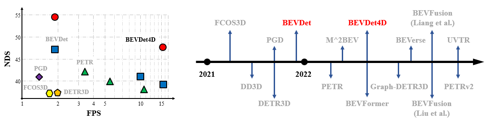
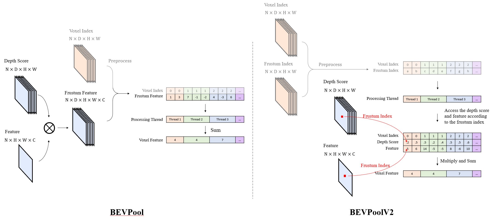
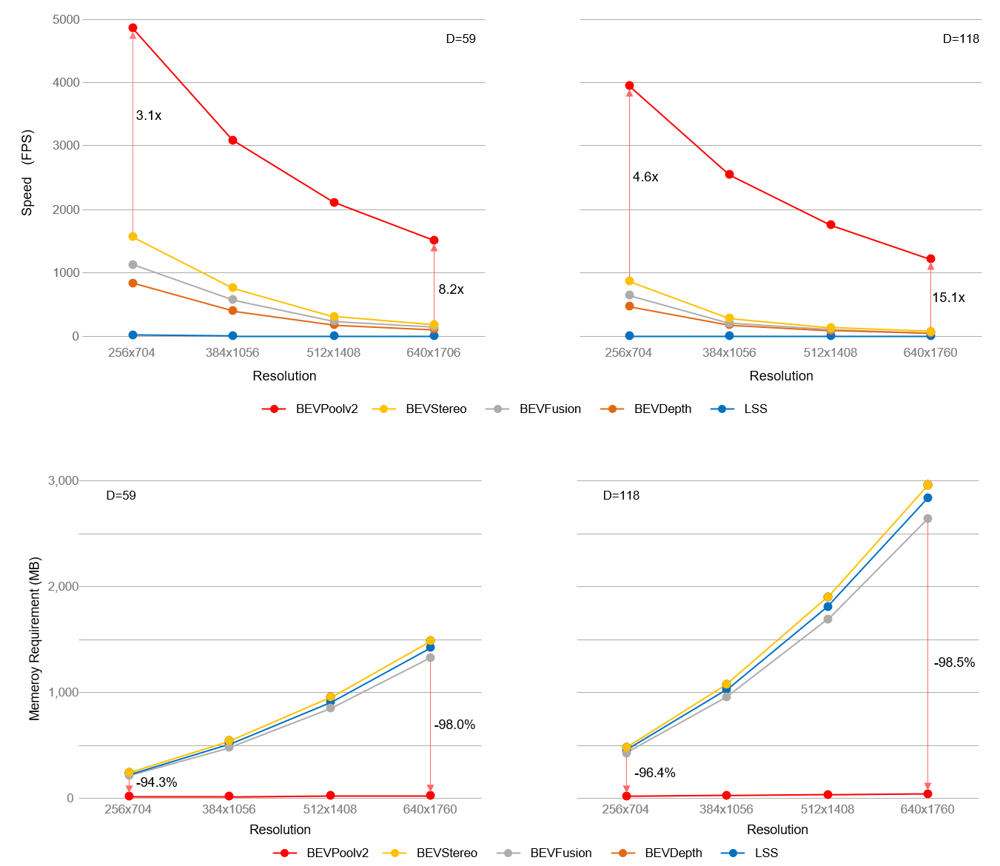

# BEVDet



## News
- **2023.05.07** Improve the occpancy baseline by enlarging the input size and using long-term temporal fusion.
- **2023.04.28** Support task of [occupancy prediction](https://github.com/CVPR2023-3D-Occupancy-Prediction/CVPR2023-3D-Occupancy-Prediction) .
- **2023.04.27** Equip BEVDet with stereo depth estimation.
- **2023.04.10** Use single head for multi-class prediction.
- **2023.01.12** Support TensorRT-INT8.
- **2022.11.24** A new branch of bevdet codebase, dubbed dev2.0, is released. dev2.0 includes the following features:

1. support **BEVPoolv2**, whose inference speed is up to **15.1 times** the previous fastest implementation of Lift-Splat-Shoot view transformer. It is also far less memory consumption.
   
   
2. use the origin of ego coordinate system as the center of the receptive field instead of the Lidar's.
3. **support conversion of BEVDet from pytorch to TensorRT.**
4. use the long term temporal fusion as SOLOFusion.
5. train models without CBGS by default.
6. use key frame for temporal fusion.
7. Technique Report [BEVPoolv2](https://arxiv.org/abs/2211.17111) in English and [Blog](https://zhuanlan.zhihu.com/p/586637783) in Chinese.

- [History](./docs/en/news.md)

## Main Results
### Nuscenes Detection
| Config                                                                    | mAP        | NDS        | Latency(ms) | FPS  | Model                                                                                          | Log                                                                                            |
| ------------------------------------------------------------------------- | ---------- | ---------- | ---- | ---- | ---------------------------------------------------------------------------------------------- | ---------------------------------------------------------------------------------------------- |
| [**BEVDet-R50**](configs/bevdet/bevdet-r50.py)                            | 28.3       | 35.0       | 29.1/4.2/33.3| 30.7 | [baidu](https://pan.baidu.com/s/1237QyV18zvRJ1pU3YzRItw?pwd=npe1) | [baidu](https://pan.baidu.com/s/1237QyV18zvRJ1pU3YzRItw?pwd=npe1) |
| [**BEVDet-R50-CBGS**](configs/bevdet/bevdet-r50-cbgs.py)                  | 31.3       | 39.8       |28.9/4.3/33.2 |30.1 | [baidu](https://pan.baidu.com/s/1237QyV18zvRJ1pU3YzRItw?pwd=npe1) | [baidu](https://pan.baidu.com/s/1237QyV18zvRJ1pU3YzRItw?pwd=npe1) |
| [**BEVDet-R50-4D-CBGS**](configs/bevdet/bevdet-r50-4d-cbgs.py) | 31.4/35.4# | 44.7/44.9# | 29.1/4.3/33.4|30.0 | [baidu](https://pan.baidu.com/s/1237QyV18zvRJ1pU3YzRItw?pwd=npe1) |[baidu](https://pan.baidu.com/s/1237QyV18zvRJ1pU3YzRItw?pwd=npe1)|
| [**BEVDet-R50-4D-Depth-CBGS**](configs/bevdet/bevdet-r50-4d-depth-cbgs.py) | 36.1/36.2# | 48.3/48.4# |35.7/4.0/39.7 |25.2 | [baidu](https://pan.baidu.com/s/1237QyV18zvRJ1pU3YzRItw?pwd=npe1) | [baidu](https://pan.baidu.com/s/1237QyV18zvRJ1pU3YzRItw?pwd=npe1) |
| [**BEVDet-R50-4D-Stereo-CBGS**](configs/bevdet/bevdet-r50-4d-stereo-cbgs.py) | 38.2/38.4# | 49.9/50.0# |-  |-  | [baidu](https://pan.baidu.com/s/1237QyV18zvRJ1pU3YzRItw?pwd=npe1) | [baidu](https://pan.baidu.com/s/1237QyV18zvRJ1pU3YzRItw?pwd=npe1) |
| [**BEVDet-R50-4DLongterm-CBGS**](configs/bevdet/bevdet-r50-4dlongterm-cbgs.py) | 34.8/35.4# | 48.2/48.7# | 30.8/4.2/35.0|28.6 | [baidu](https://pan.baidu.com/s/1237QyV18zvRJ1pU3YzRItw?pwd=npe1) | [baidu](https://pan.baidu.com/s/1237QyV18zvRJ1pU3YzRItw?pwd=npe1) |
| [**BEVDet-R50-4DLongterm-Depth-CBGS**](configs/bevdet/bevdet-r50-4d-depth-cbgs.py) | 39.4/39.9# | 51.5/51.9# |38.4/4.0/42.4 |23.6 | [baidu](https://pan.baidu.com/s/1237QyV18zvRJ1pU3YzRItw?pwd=npe1) | [baidu](https://pan.baidu.com/s/1237QyV18zvRJ1pU3YzRItw?pwd=npe1) |
| [**BEVDet-R50-4DLongterm-Stereo-CBGS**](configs/bevdet/bevdet-r50-4dlongterm-stereo-cbgs.py) | 41.1/41.5# | 52.3/52.7# |- |- | [baidu](https://pan.baidu.com/s/1237QyV18zvRJ1pU3YzRItw?pwd=npe1) | [baidu](https://pan.baidu.com/s/1237QyV18zvRJ1pU3YzRItw?pwd=npe1) |
| [**BEVDet-STBase-4D-Stereo-512x1408-CBGS**](configs/bevdet/bevdet-stbase-4d-stereo-512x1408-cbgs.py) | 47.2# | 57.6# |-  |-  | [baidu](https://pan.baidu.com/s/1237QyV18zvRJ1pU3YzRItw?pwd=npe1) | [baidu](https://pan.baidu.com/s/1237QyV18zvRJ1pU3YzRItw?pwd=npe1) |

\# align previous frame bev feature during the view transformation.

Depth: Depth supervised from Lidar as BEVDepth.

Longterm: cat 8 history frame in temporal modeling. 1 by default. 

Stereo: A private implementation that concat cost-volumn with image feature before executing model.view_transformer.depth_net.

The latency includes Network/Post-Processing/Total. Training without CBGS is deprecated.


### Nuscenes Occupancy
| Config                                                                    | mIOU       | Model | Log                                                                                            |
| ------------------------------------------------------------------------- | ---------- | ---------------------------------------------------------------------------------------------- | ---------------------------------------------------------------------------------------------- |
| [**BEVDet-Occ-R50-4D-Stereo-2x**](configs/bevdet_occ/bevdet-occ-r50-4d-stereo-24e.py)                                 | 36.1     | [baidu](https://pan.baidu.com/s/1237QyV18zvRJ1pU3YzRItw?pwd=npe1) | [baidu](https://pan.baidu.com/s/1237QyV18zvRJ1pU3YzRItw?pwd=npe1) |
| [**BEVDet-Occ-R50-4D-Stereo-2x-384x704**](configs/bevdet_occ/bevdet-occ-r50-4d-stereo-24e_384704.py)                  | 37.3     | [baidu](https://pan.baidu.com/s/1237QyV18zvRJ1pU3YzRItw?pwd=npe1) | [baidu](https://pan.baidu.com/s/1237QyV18zvRJ1pU3YzRItw?pwd=npe1) |
| [**BEVDet-Occ-R50-4DLongterm-Stereo-2x-384x704**](configs/bevdet_occ/bevdet-occ-r50-4dlongterm-stereo-24e_384704.py)  | 39.3     | [baidu](https://pan.baidu.com/s/1237QyV18zvRJ1pU3YzRItw?pwd=npe1) | [baidu](https://pan.baidu.com/s/1237QyV18zvRJ1pU3YzRItw?pwd=npe1) |
| [**BEVDet-Occ-STBase-4D-Stereo-2x**](configs/bevdet_occ/bevdet-occ-stbase-4d-stereo-512x1408-24e.py)                  | 42.0     | [baidu](https://pan.baidu.com/s/1237QyV18zvRJ1pU3YzRItw?pwd=npe1) | [baidu](https://pan.baidu.com/s/1237QyV18zvRJ1pU3YzRItw?pwd=npe1) |
## Inference latency with different backends

| Backend       | 256x704 | 384x1056 | 512x1408 | 640x1760 |
| ------------- | ------- | -------- | -------- | -------- |
| PyTorch       | 28.9    | 49.7     | 78.7    | 113.4    |
| TensorRT      | 14.0    | 22.8     | 36.5     | 53.0     |
| TensorRT-FP16 | 4.94     | 7.96     | 12.4     | 17.9     |
| TensorRT-INT8 | 2.93    | 4.41      | 6.58      | 9.19     |                                      
| TensorRT-INT8(Xavier) | 25.0    | -      | -     | -    | 

- Evaluate with [**BEVDet-R50-CBGS**](configs/bevdet/bevdet-r50-cbgs.py) on a RTX 3090 GPU by default. We omit the postprocessing, which spends up to 5 ms with the PyTorch backend.

## Get Started

#### Installation and Data Preparation

step 1. Please prepare environment as that in [Docker](docker/Dockerfile).

step 2. Prepare bevdet repo by.
```shell script
git clone https://github.com/HuangJunJie2017/BEVDet.git
cd BEVDet
pip install -v -e .
```

step 3. Prepare nuScenes dataset as introduced in [nuscenes_det.md](docs/en/datasets/nuscenes_det.md) and create the pkl for BEVDet by running:
```shell
python tools/create_data_bevdet.py
```
step 4. For Occupancy Prediction task, download (only) the 'gts' from [CVPR2023-3D-Occupancy-Prediction](https://github.com/CVPR2023-3D-Occupancy-Prediction/CVPR2023-3D-Occupancy-Prediction) and arrange the folder as:
```shell script
└── nuscenes
    ├── v1.0-trainval (existing)
    ├── sweeps  (existing)
    ├── samples (existing)
    └── gts (new)
```

#### Train model
```shell
# single gpu
python tools/train.py $config
# multiple gpu
./tools/dist_train.sh $config num_gpu
```

#### Test model
```shell
# single gpu
python tools/test.py $config $checkpoint --eval mAP
# multiple gpu
./tools/dist_test.sh $config $checkpoint num_gpu --eval mAP
```

#### Estimate the inference speed of BEVDet

```shell
# with pre-computation acceleration
python tools/analysis_tools/benchmark.py $config $checkpoint --fuse-conv-bn
# 4D with pre-computation acceleration
python tools/analysis_tools/benchmark_sequential.py $config $checkpoint --fuse-conv-bn
# view transformer only
python tools/analysis_tools/benchmark_view_transformer.py $config $checkpoint
```

#### Estimate the flops of BEVDet

```shell
python tools/analysis_tools/get_flops.py configs/bevdet/bevdet-r50.py --shape 256 704
```

#### Visualize the predicted result.

- Private implementation. (Visualization remotely/locally)

```shell
python tools/test.py $config $checkpoint --format-only --eval-options jsonfile_prefix=$savepath
python tools/analysis_tools/vis.py $savepath/pts_bbox/results_nusc.json
```

#### Convert to TensorRT and test inference speed.

```shell
1. install mmdeploy from https://github.com/HuangJunJie2017/mmdeploy
2. convert to TensorRT
python tools/convert_bevdet_to_TRT.py $config $checkpoint $work_dir --fuse-conv-bn --fp16 --int8
3. test inference speed
python tools/analysis_tools/benchmark_trt.py $config $engine
```

## Acknowledgement

This project is not possible without multiple great open-sourced code bases. We list some notable examples below.

- [open-mmlab](https://github.com/open-mmlab)
- [CenterPoint](https://github.com/tianweiy/CenterPoint)
- [Lift-Splat-Shoot](https://github.com/nv-tlabs/lift-splat-shoot)
- [Swin Transformer](https://github.com/microsoft/Swin-Transformer)
- [BEVFusion](https://github.com/mit-han-lab/bevfusion)
- [BEVDepth](https://github.com/Megvii-BaseDetection/BEVDepth)

Beside, there are some other attractive works extend the boundary of BEVDet.

- [BEVerse](https://github.com/zhangyp15/BEVerse)  for multi-task learning.
- [BEVStereo](https://github.com/Megvii-BaseDetection/BEVStereo)  for stero depth estimation.

## Bibtex

If this work is helpful for your research, please consider citing the following BibTeX entry.

```
@article{huang2022bevpoolv2,
  title={BEVPoolv2: A Cutting-edge Implementation of BEVDet Toward Deployment},
  author={Huang, Junjie and Huang, Guan},
  journal={arXiv preprint arXiv:2211.17111},
  year={2022}
}

@article{huang2022bevdet4d,
  title={BEVDet4D: Exploit Temporal Cues in Multi-camera 3D Object Detection},
  author={Huang, Junjie and Huang, Guan},
  journal={arXiv preprint arXiv:2203.17054},
  year={2022}
}

@article{huang2021bevdet,
  title={BEVDet: High-performance Multi-camera 3D Object Detection in Bird-Eye-View},
  author={Huang, Junjie and Huang, Guan and Zhu, Zheng and Yun, Ye and Du, Dalong},
  journal={arXiv preprint arXiv:2112.11790},
  year={2021}
}
```
