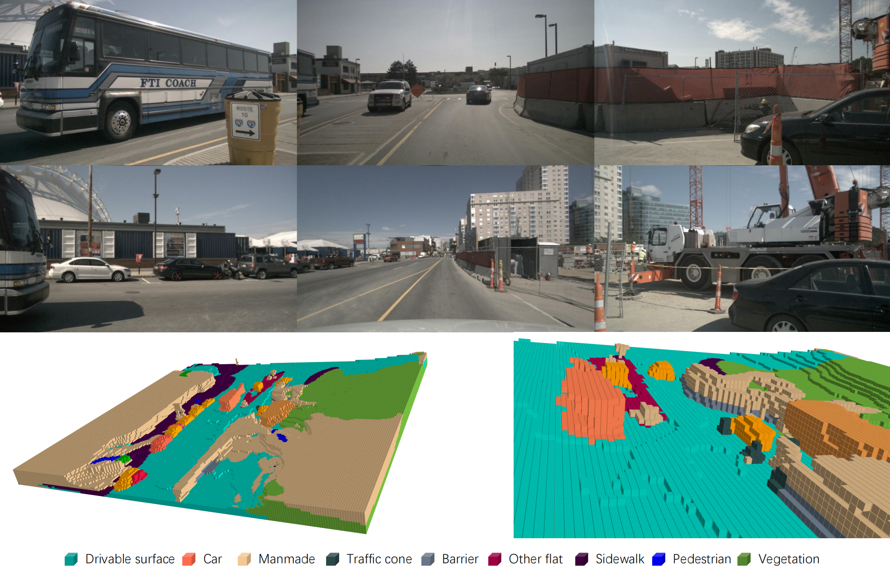

# Forward-Backward View Transformation for Vision-Centric AV Perception

<p align="center">

</p>

### [Paper (FB-BEV)](https://arxiv.org/abs/2308.02236) | [Paper (FB-OCC)](https://arxiv.org/abs/2307.01492) | [Intro Video](https://youtu.be/KEn8oklzyvo?si=zydZjIwoTzTd-bsO)

FB-BEV and FB-OCC are a family of vision-centric 3D object detection and occupancy prediction methods based on forward-backward view transformation.

## News
- `[2023/8/01]` FB-BEV was accepted to ICCV 2023.
- 🏆 `[2023/6/16]` FB-OCC wins both Outstanding Champion and Innovation Award  in [Autonomous Driving Challenge](https://opendrivelab.com/AD23Challenge.html#Track3) in conjunction with CVPR 2023  End-to-End Autonomous Driving Workshop and  Vision-Centric Autonomous Driving Workshop.


## Getting Started
- [Installation](docs/install.md)
- [Prepare Dataset](docs/prepare_datasets.md)
- [Training, Eval, Visualization](docs/start.md)
 
## Model Zoo

| Backbone | Method | Lr Schd | IoU|  Config | Download |
| :---: | :---: | :---: | :---: | :---: | :---: |
| R50 | FB-OCC | 20ep | 39.1 |[config](occupancy_configs/fb_occ/fbocc-r50-cbgs_depth_16f_16x4_20e.py) |[model](https://github.com/zhiqi-li/storage/releases/download/v1.0/fbocc-r50-cbgs_depth_16f_16x4_20e.pth)|

* More model weights will be released later.

## License

Copyright © 2022 - 2023, NVIDIA Corporation. All rights reserved.

This work is made available under the Nvidia Source Code License-NC. Click [here](https://github.com/NVlabs/FB-BEV/blob/main/LICENSE) to view a copy of this license.

The pre-trained models are shared under CC-BY-NC-SA-4.0. If you remix, transform, or build upon the material, you must distribute your contributions under the same license as the original.

For business inquiries, please visit our website and submit the form: [NVIDIA Research Licensing](https://www.nvidia.com/en-us/research/inquiries/).

## Citation
If this work is helpful for your research, please consider citing:

```
@inproceedings{li2023fbbev,
  title={{FB-BEV}: {BEV} Representation from Forward-Backward View Transformations},
  author={Li, Zhiqi and Yu, Zhiding and Wang, Wenhai and Anandkumar, Anima and Lu, Tong and Alvarez, Jose M},
  booktitle={IEEE/CVF International Conference on Computer Vision (ICCV)},
  year={2023}
}
```

```
@article{li2023fbocc,
  title={{FB-OCC}: {3D} Occupancy Prediction based on Forward-Backward View Transformation},
  author={Li, Zhiqi and Yu, Zhiding and Austin, David and Fang, Mingsheng and Lan, Shiyi and Kautz, Jan and Alvarez, Jose M},
  journal={arXiv:2307.01492},
  year={2023}
}
```

## Acknowledgement

Many thanks to these excellent open source projects:

- [BEVFormer](https://github.com/fundamentalvision/BEVFormer), [BEVDet](https://github.com/HuangJunJie2017/BEVDet), [Occ3D](https://github.com/Tsinghua-MARS-Lab/Occ3D), [OpenOccupancy](https://github.com/JeffWang987/OpenOccupancy), [SoloFusion](https://github.com/Divadi/SOLOFusion)
